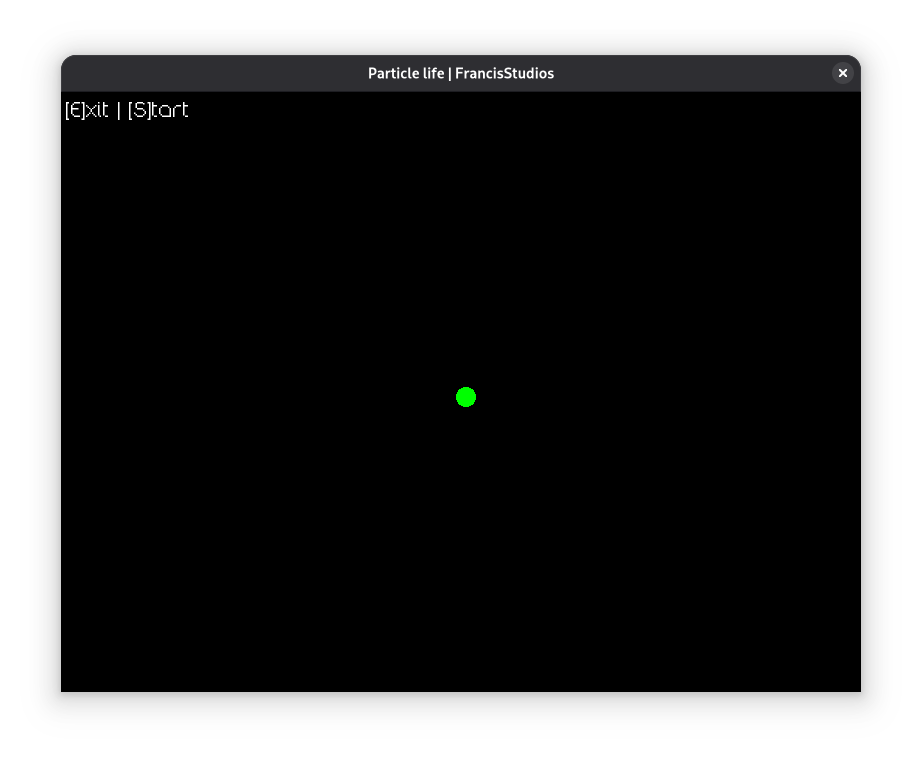

# 🔵 Particle Life Simulation
#### a version by `Francis Studios` - Open Source Sotware

Particle life simulation is quite a popular concept in evolution and genetics research, as a simple modell that we can study and simulate different scenarios by just adjusting weights in the sim's configuration. This is a little experiment by me, so I get to have a little fun with the concept myself.

## ⬇️ Downloads
🐧 [Linux (pre-release v0.0.1)](./dist/linux/particle-life_linux)

🪟 [Windows (pre-release v0.0.1)](./dist/windows/particle-life_windows)

```
Keep in mind, while only pre-release versions are up, the application is not in a ready state! It's only a demo which you can play around and experiment with. Absolutely no responsibility taken.
```

