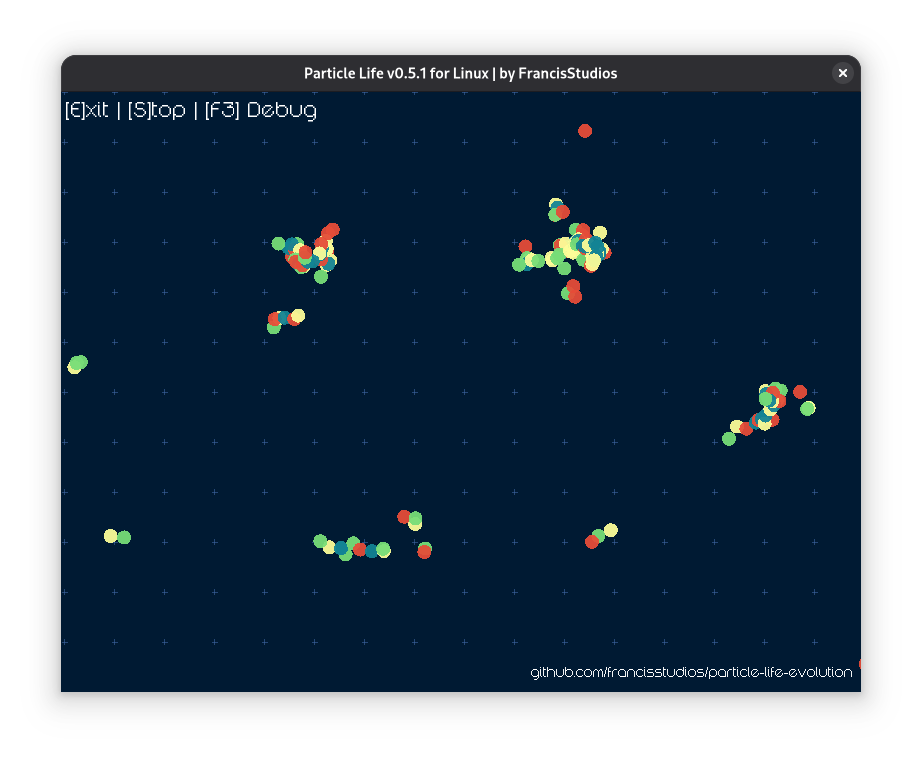
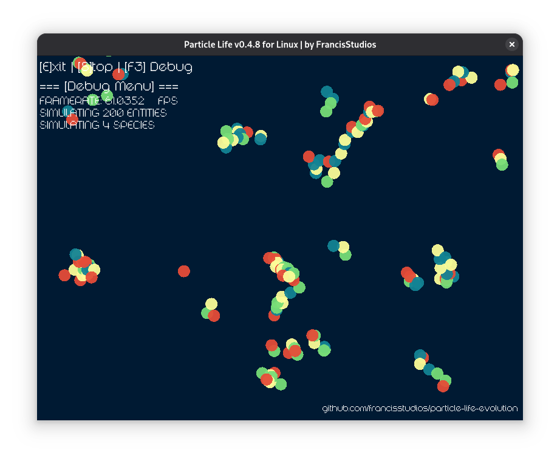
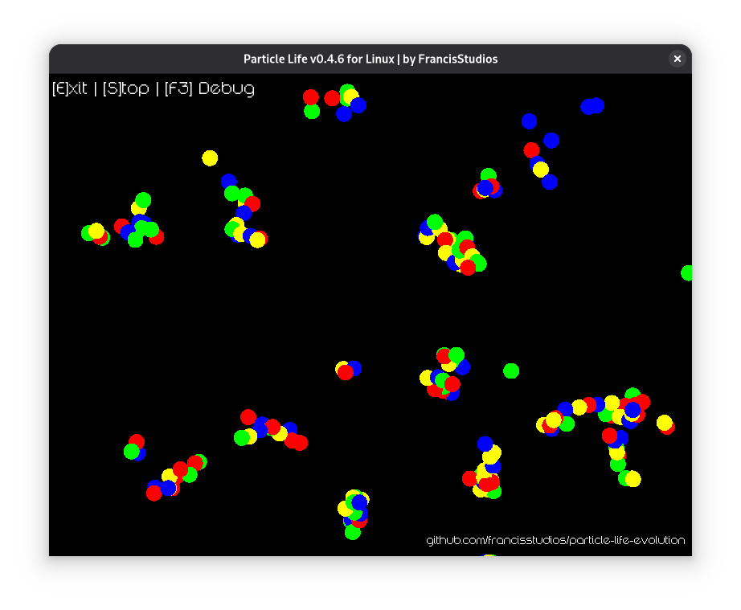

# 🔵 Particle Life Simulation
#### a version by `Francis Studios` - Open Source Sotware

Particle life simulation is quite a popular concept in evolution and genetics research, as a simple modell that we can study and simulate different scenarios by just adjusting weights in the sim's configuration. This is a little experiment by me, so I get to have a little fun with the concept myself.

## ⬇️ Downloads
🐧 [Linux (pre-release v0.5.1)](./dist/linux/)

🪟 [Windows (pre-release v0.5.1)](./dist/windows/)

>[!WARNING]
> The author `Francis Studios Softwares` doesn't take any responsibilities over this and other Open Source applications, **use at your own risk and responsibility**

### Note
Now debug menu is available in the application, with a couple of simulation stats, in later versions this list will grow and adapt to new information and features.



The development of this simulation was a learning experience for me, since I haven't gotten so far with particle simulations yet. Over the years I've tried different approaches but **this seems to be the most complete yet** as previous attempts were **too overcomplicated** to maintain and develop for longer periods of time, also keeping the scope low enough to be able to survive as a single developer project. 

In this _"run"_ I managed to keep the logic simple and clean, the repository easy to read and understand and the **scope focused on the minimal viable product**. This application has grown over multiple prerelease versions, getting more and more features over the times **and still getting updates regularly**



We can `observe` beautiful, and matematically / _scientifically_ interesting patterns just as they can be observed / _be present_ in nature. This project aims to simulate particle interactions (push and pull forces) and in later versions evolution and life simulation on a very simplistic, but easy to understand scale.



## ⚙️ Simulation Config Editing

The `sim.conf.json` file is where all the simulation settings are stored and read into the application state. You can modify / edit each parameter so you can **tune your custom simulation**

>[!note]
> Please keep the syntactical rules of JSON _(as you would anywhere else)_. Improper config file may **crash the application**.


```JSON
{
    // CONFIG.file
    // Do not modify this, unless you are specifically 
    // instructed to. This is a flag for the application 
    // to know what config version is loaded (backwards comp)
    "file": "ple-simconfig-1.x",
    
    // CONFIG["simulation-size"]
    // This sets the generation size and the screen size.
    // Our entites can spawn inside of this rectangle, also
    // the screen size represents this area. -- will be se-
    // -parated future versions.
    "simulation-size": {
        "width": 800,
        "height": 600
    },

    // CONFIG["particle-size"]
    // This sets the radius of our entities - so you can even
    // resize the particles if needed.
    "particle-size": 10.0,

    // CONFIG["entity-spawn-seed"]
    // In current versions only random spawning is allowed, but
    // in future versions generation seeds will be available so you
    // can test specific scenarios over and over again.
    "entity-spawn-seed": "random",

    // CONFIG["entity-count"]
    // Number of entities to be generated and rendered
    "entity-count": 200,

    // CONFIG["species-count"]
    // Number of species to be generated. Keep in mind that
    // changing this value must be followed with EXTENDING
    // THE SPECIES LIST BELOW, otherwise the simulation can 
    // not be started.
    "species-count": 4,
}
```

### Species object:

The species list `species[]` holds the definition of each species of the simulation (as the name implies).

If you modify the `species-count` property, you must define the new species within this list:

```JSON
"species": [
        {
            "name": "goblin",
            "color": "green",
            "speed": 100,
            "detection-radius": 100.0
        },
        {
            "name": "rotblud",
            "color": "red",
            "speed": 80,
            "detection-radius": 100.0
        },
        {
            "name": "dwarf",
            "color": "yellow",
            "speed": 30,
            "detection-radius": 100.0
        },
        {
            "name": "elf",
            "color": "blue",
            "speed": 15,
            "detection-radius": 100.0
        }
    ],
```

- `name` : _String_ -> the name of the species. You can come up with any name that can fit into the json string format - for best performance keep special characters and super long names out - names must be unique for each species if repetition occurs, than the simulation will display false actions or might crash. 
- `color` : _String<"Color">_ -> this value will set the color of the speices. CURRENTLY ONLY THIS FOUR COLOR IS AVAILABLE, in later I will extend the color selection.
- `speed` : _Number_ -> this value represents the speed of each species. **Keep this number between 0-100.**
- `detection-radius` : _Number<"Float">_ this number represents of how far (in px) can our species see - in this radius will the forces to other entities apply.  